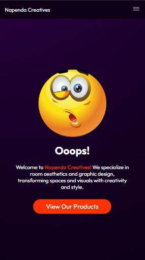
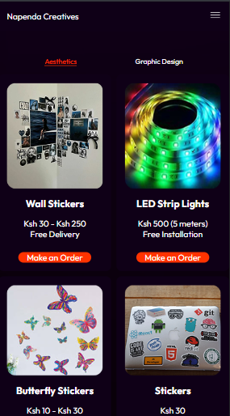
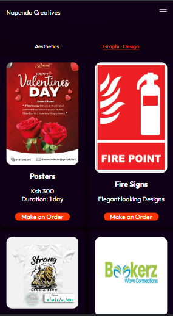

# Napenda Creatives Website
<div style ={{
   display:flex,
   align-items:center,
   justify-content:center,
}}>
   



</div>

## 🚀 Project Overview
Napenda Creatives is a platform that highlights artistic and innovative works. The website is designed to be visually appealing, user-friendly, and responsive across different devices.

## 📂 Project Structure
```
/napenda-creatives
│── index.html      # Main landing page
│── about.html      # About Us page
│── services.html   # Services offered
│── contact.html    # Contact information
│── assets/         # Images, icons, fonts
│── css/            # Stylesheets
│── js/             # JavaScript files
│── README.md       # Project documentation
```

## 🌟 Features
- **Responsive Design** - Works on all screen sizes
- **Modern UI/UX** - Clean and attractive design
- **Optimized Performance** - Fast load times and SEO friendly
- **Interactive Elements** - Animations and smooth transitions

## 🛠️ Technologies Used
- **HTML5** - Structure of the website
- **CSS3** - Styling and responsiveness
- **JavaScript** - Interactive features


## 📌 Installation
To run the website locally:
1. Clone the repository:
   ```bash
   git clone https://github.com/your-username/napenda-creatives.git
   ```
2. Navigate to the project folder:
   ```bash
   cd napenda-creatives
   ```
3. Open `index.html` in your browser.

## 📞 Contact
For any inquiries, you can reach out at:
- **Email**: napendacreatives@gmail.com
- **Website**: 

---
### 🌟 Contributing
If you’d like to contribute, feel free to fork the repository and submit a pull request.

---
#### 📜 License
This project is licensed under the **MIT License**.
